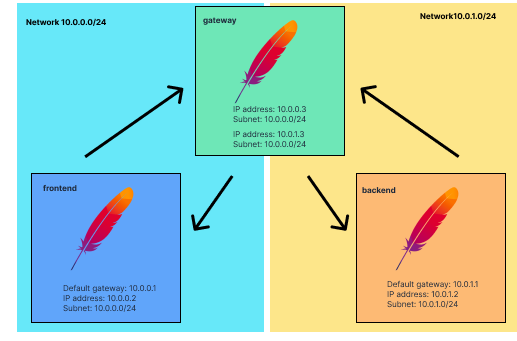

# Docker network tutorial


## Step1: Create networks
```sh
# Create 2 networks for frontend and backend
docker network create <frontend|backend> --subnet <10.0.0.0/24|10.0.1.0/24>
```

## Step2: Create containers with httpd image
```sh
# create a httpd image
docker build . -t <name for httpd image>

# create 3 container
# give permission to edit network setting by --cap-add=NET_ADMIN
# gateway should belong to both network. However docker run command can only one network
# run the network connect command
docker run --name <frontend|backend|gateway> --network <network name> --cap-add=NET_ADMIN -d <image name>
docker network connect <network name> gateway

# make sure that the networks properly configured
docker network inspect <frontend|backend>
```

## Step3: Add route to allow networks communicate each other through gateway
```sh
# enter the container
docker exec -it <frontend|backend|gateway> bash

# set route
# $container> ip route add <target network> via <gateway ip address>
# if per mission denied, see step2
$container> ip route add <10.0.0.0/24|10.0.1.0/24> via <gateway ip address>
```

## Step4: Make sure networks are able to communicate each other
```sh
# make sure its ip address
$container> hostname -i

$container> ping <another network ip address>

# make sure that the communication is through gateway
$container> traceroute <another network ip address>
```
